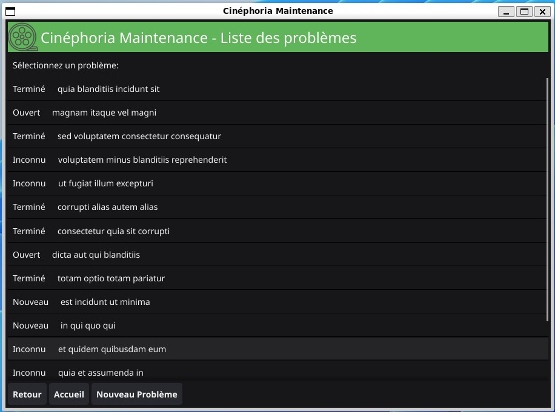
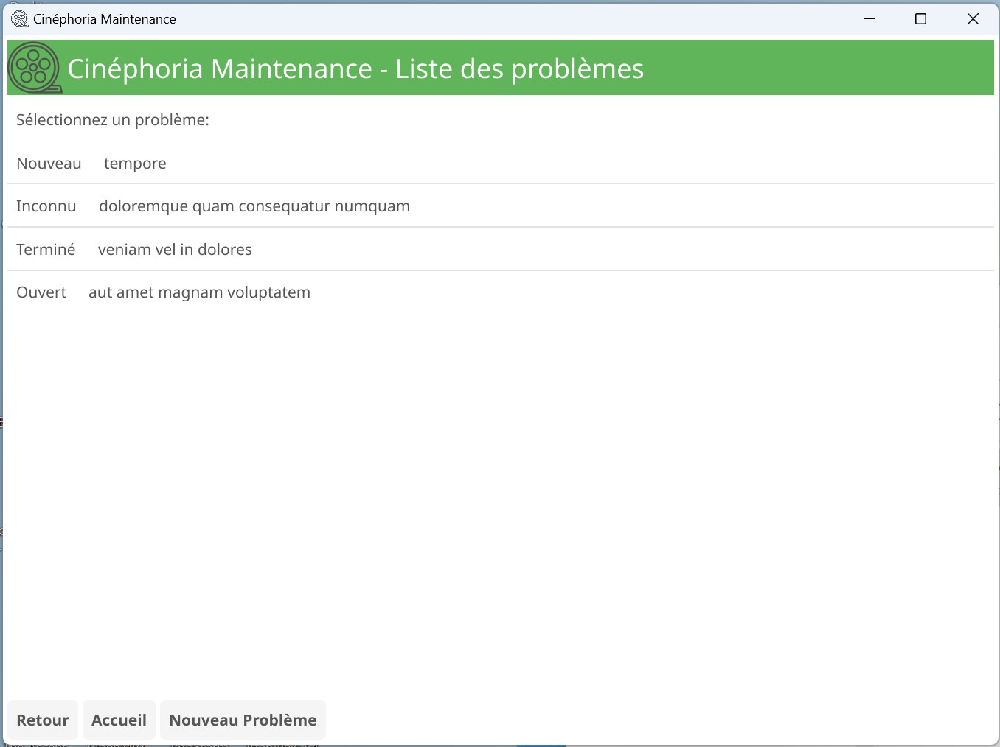
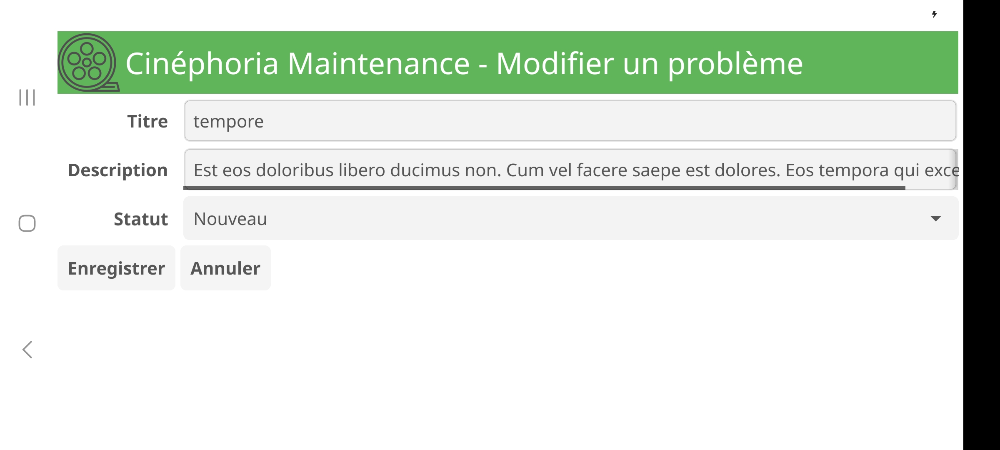

# Application de bureau Cinéphoria

Cinéphoria Maintenance est une application desktop multiplateformes (Linux, FreeBSD, Windows, Darwin, Android) supportant de multiples architectures.

Vous pouvez télécharger la version de l'application qui correspond à votre OS dans l'onglet Release. Si vous souhaitez une version pour les OS d'Apple, vous devez la compiler vous-même sur une machine Apple.

## Exemples

Sur Linux :

Sur Windows :

Et même sur Android :

## Construire localement avec Linux

Vous devez installer Go et les dépendances du projet (pour Linux) :

    $ sudo apt-get update && sudo apt-get install gcc libgl1-mesa-dev libegl1-mesa-dev libgles2-mesa-dev libx11-dev xorg-dev bc
    $ sudo apt install go
    $ cd /chemin/vers/mon/projet
    $ go mod tidy
    $ go build

## Cross-compilation

Construire pour une autre plateforme (par exemple Windows, Mac, Android...) avec les outils multiplateformes de Fyne (cf. https://docs.fyne.io/started/cross-compiling.html and https://github.com/fyne-io/fyne-cross).

    $ fyne-cross windows -arch=*
    $ fyne-cross linux -arch=*
    $ fyne-cross darwin -arch=*
    $ fyne-cross freebsd -arch=*
    $ fyne-cross ios
    $ fyne-cross android
